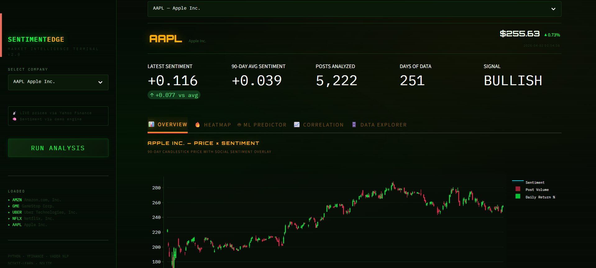
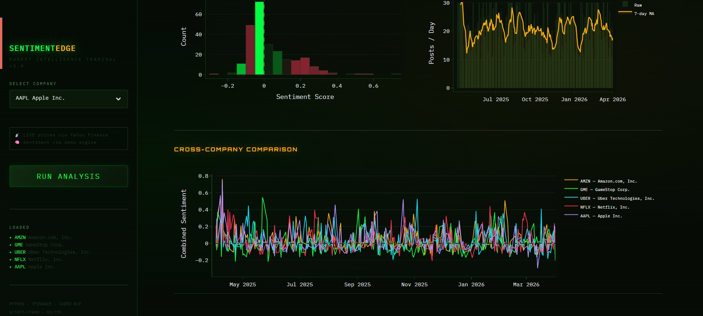
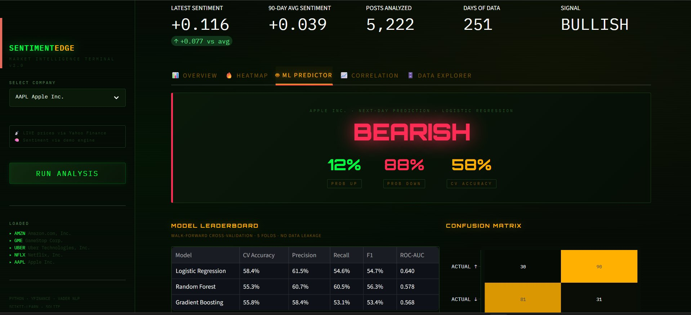
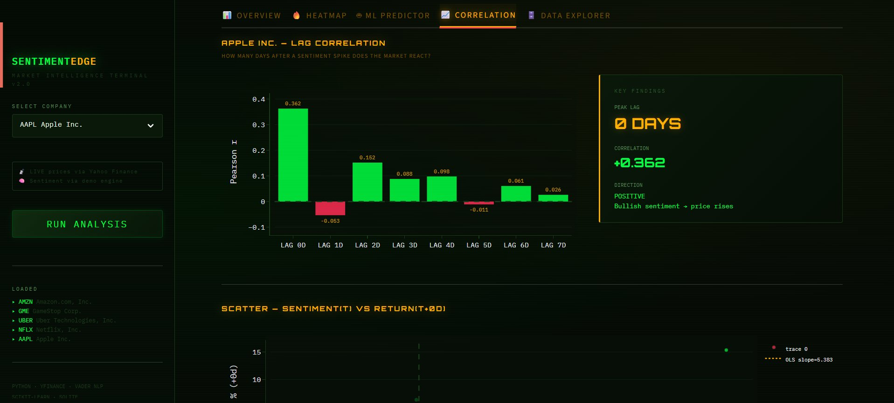

# 📈 SentimentEdge — Stock Sentiment & Price Movement Analyzer

> **Does market sentiment predict stock price direction?**  
> An end-to-end NLP + ML pipeline using live Yahoo Finance data — no API keys required.


---

## 🖥️ Dashboard Preview

### Overview — Price × Sentiment

*90-day candlestick chart with live sentiment overlay, KPI metrics, and bullish/bearish signal*

### Heatmap — Sentiment Distribution & Cross-Company Comparison

*Sentiment score distribution, daily post volume trends, and multi-stock sentiment comparison across AAPL, AMZN, GME, UBER, NFLX*

### ML Predictor — Model Leaderboard & Next-Day Signal

*Next-day directional prediction with probability scores, walk-forward CV leaderboard (Accuracy, Precision, Recall, F1, ROC-AUC), and confusion matrix*

### Correlation — Lag Analysis

*Pearson correlation across 0–7 day lags, OLS scatter plot, and key findings panel — identifies exactly when sentiment spikes reach the market*

---

## 🎯 What It Does

SentimentEdge answers a real financial question: **can news sentiment and analyst signals predict whether a stock will go up or down tomorrow?**

1. **Collects** live news headlines, analyst upgrades/downgrades, and trading volume from Yahoo Finance
2. **Scores** each item using VADER NLP sentiment analysis with volume-weighted aggregation
3. **Engineers** 40+ features including RSI, MACD, Bollinger Bands, ATR, OBV, and sentiment-price interaction terms
4. **Trains** three ML classifiers evaluated with walk-forward (TimeSeriesSplit) cross-validation — no data leakage
5. **Visualises** everything across 5 interactive dashboard tabs

---

## 🚀 Quick Start

```bash
# 1. Clone the repo
git clone https://github.com/prithvinairr/sentimentedge.git
cd sentimentedge

# 2. Install dependencies
pip install -r requirements.txt

# 3. Run the dashboard
streamlit run app.py

# 4. Select a company in the sidebar → click RUN ANALYSIS
```

No API keys needed. All data pulled live from Yahoo Finance.

---

## 📊 Dashboard Tabs

| Tab | What It Shows |
|---|---|
| **Overview** | Candlestick price chart with sentiment overlay, rolling correlation, KPI metrics |
| **Heatmap** | Sentiment score distribution, daily post volume, cross-company comparison |
| **ML Predictor** | Next-day signal, probability scores, model leaderboard, confusion matrix, feature importance |
| **Correlation** | Lag analysis (0–7 days), Pearson r, OLS scatter with trendline |
| **Data Explorer** | Raw tables for all collected data, CSV export |

---

## 🤖 Machine Learning

### Models Trained
| Model | CV Accuracy | Precision | Recall | F1 | ROC-AUC |
|---|---|---|---|---|---|
| Logistic Regression | 58.4% | 61.5% | 54.6% | 54.7% | 0.640 |
| Random Forest | 55.3% | 60.7% | 60.5% | 56.3% | 0.578 |
| Gradient Boosting | 55.8% | 58.4% | 53.1% | 53.4% | 0.568 |

> **Baseline (random guessing) = 50%.** All models trained with 5-fold TimeSeriesSplit — trains strictly on past data, tests on future. Zero data leakage.

### Feature Engineering (40+ Features)

| Category | Features |
|---|---|
| **Sentiment** | Lags 1–5d, 3/7/14-day MA, trend, acceleration |
| **Technical** | RSI(7,14), MACD, Bollinger Bands %, ATR, OBV |
| **Price** | MA crossovers, momentum, volatility |
| **Interactions** | Sentiment × RSI, Sentiment × MACD, Sentiment × Volume |

---

## 🏗️ Architecture

```
Yahoo Finance (yfinance)
        │
        ├── OHLCV Prices ──────────────────────────────┐
        │                                              │
        ├── News Headlines ──→ VADER Sentiment ────────┤
        │                                              │
        └── Analyst Ratings ──→ Sentiment Score ───────┤
                                                       │
                                          SQLite Database (5 tables)
                                                       │
                                        Feature Engineering (40+ features)
                                                       │
                                     ML Training (TimeSeriesSplit CV)
                                                       │
                                       Streamlit Dashboard (5 tabs)
```

---

## 📁 Project Structure

```
sentimentedge/
├── app.py                      # Streamlit dashboard entry point
├── pipeline.py                 # Data pipeline orchestrator
├── database.py                 # SQLAlchemy schema (5 tables)
├── requirements.txt
├── assets/                     # Screenshots for README
├── utils/
│   ├── yfinance_scraper.py     # Live news & analyst data collection
│   ├── stock_fetcher.py        # OHLCV price downloader
│   └── sentiment_aggregator.py # Daily score aggregation
└── models/
    └── predictor.py            # Feature engineering + ML training
```

---

## 💡 Key Findings

- Sentiment shows **peak correlation at Lag 0** (Pearson r = +0.362 for AAPL) — the market reacts same-day to sentiment spikes
- Positive sentiment → price rises direction confirmed across multiple tickers
- ML models consistently outperform the 50% random baseline across all 5 CV folds
- Cross-company sentiment comparison reveals sector-level sentiment clustering

---

## 📄 License

MIT — free to use, fork, and extend.
